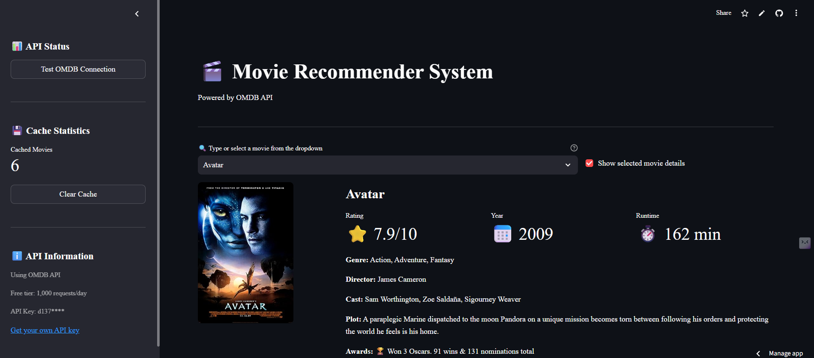

# 🎬 Movie Recommender System

A content-based movie recommendation system that suggests similar movies based on your preferences. Built with Python, Streamlit, and powered by OMDB API for real-time movie information.

[](https://movie-recommender-system-vad.streamlit.app/)
[](https://www.python.org/downloads/)
[](LICENSE)

## 🌟 Live Demo

Check out the live application: [Movie Recommender System](https://movie-recommender-system-vad.streamlit.app/)

## 📸 Screenshots


*Dark theme interface with movie recommendations*

## ✨ Features

- **Content-Based Filtering**: Recommends movies based on content similarity using machine learning
- **Real-Time Movie Data**: Fetches current movie information including posters, ratings, cast, and plot details
- **Interactive UI**: User-friendly interface with dark theme support
- **Detailed Information**: Shows comprehensive movie details including:
  - IMDb ratings
  - Release year
  - Runtime
  - Genre
  - Director & cast
  - Plot summary
  - Awards
- **Similarity Scoring**: Visual representation of how closely movies match
- **Export Functionality**: Download recommendations as a text file
- **Responsive Design**: Works seamlessly on desktop and mobile devices
- **Caching System**: Efficient API usage with built-in caching mechanism

## 🛠️ Technology Stack

- **Frontend**: Streamlit
- **Backend**: Python
- **Machine Learning**: scikit-learn
- **Data Processing**: Pandas, NumPy
- **API Integration**: OMDB API
- **Deployment**: Streamlit Cloud
- **Styling**: Custom CSS with dark theme

## 🚀 Installation & Setup

### Prerequisites

- Python 3.8 or higher
- pip package manager

### Local Development

1. **Clone the repository**
   ```bash
   git clone https://github.com/v-a-dinesh/movie-recommender-system.git
   cd movie-recommender-system
   ```

2. **Create a virtual environment**
   ```bash
   python -m venv venv
   
   # On Windows
   venv\Scripts\activate
   
   # On macOS/Linux
   source venv/bin/activate
   ```

3. **Install dependencies**
   ```bash
   pip install -r requirements.txt
   ```

4. **Set up environment variables**
   
   Create a `.env` file in the root directory:
   ```env
   OMDB_API_KEY=your_api_key_here
   ```
   
   Get your free API key from [OMDB API](http://www.omdbapi.com/apikey.aspx)

5. **Prepare the data files**
   
   Place the following files in the `data/` directory:
   - `movie_list.pkl`: Preprocessed movie dataset
   - `similarity.pkl`: Precomputed similarity matrix

6. **Run the application**
   ```bash
   streamlit run app.py
   ```

7. **Access the application**
   
   Open your browser and navigate to `http://localhost:8501`

## 📁 Project Structure

```
movie-recommender-system/
│
├── app.py                 # Main Streamlit application
├── requirements.txt       # Python dependencies
├── README.md             # Project documentation
├── .gitignore            # Git ignore file
│
├── data/                 # Data files directory
│   ├── movie_list.pkl    # Movie dataset
│   └── similarity.pkl    # Similarity matrix
│
└── .streamlit/           # Streamlit configuration
    └── config.toml       # Theme and app settings
```

## 🔧 Configuration

### Streamlit Configuration

The app uses a custom dark theme defined in `.streamlit/config.toml`:

```toml
[theme]
base = "dark"
primaryColor = "#FF4B4B"
backgroundColor = "#0E1117"
secondaryBackgroundColor = "#262730"
textColor = "#FAFAFA"
```

### API Configuration

The application uses OMDB API for fetching movie details. Free tier includes:
- 1,000 requests per day
- Poster images
- Movie metadata

## 🎯 How It Works

1. **Data Loading**: The system loads preprocessed movie data and similarity matrix
2. **User Selection**: User selects a movie from the dropdown menu
3. **Similarity Calculation**: The system finds the most similar movies based on content features
4. **API Integration**: Fetches real-time movie information from OMDB API
5. **Display Results**: Shows top 5 recommendations with similarity scores

### Content-Based Filtering Algorithm

The recommendation system uses content-based filtering which:
- Analyzes movie features (genre, keywords, cast, crew)
- Calculates similarity scores between movies
- Recommends movies with highest similarity scores

## 🤝 Contributing

Contributions are welcome! Please feel free to submit a Pull Request. For major changes, please open an issue first to discuss what you would like to change.

1. Fork the repository
2. Create your feature branch (`git checkout -b feature/AmazingFeature`)
3. Commit your changes (`git commit -m 'Add some AmazingFeature'`)
4. Push to the branch (`git push origin feature/AmazingFeature`)
5. Open a Pull Request

## 📝 Future Enhancements

- [ ] Add collaborative filtering
- [ ] Implement user authentication
- [ ] Save favorite movies
- [ ] Add more filtering options (year, genre, rating)
- [ ] Include TV shows
- [ ] Multi-language support
- [ ] Advanced search functionality
- [ ] User ratings and reviews

## 🐛 Known Issues

- API rate limits may affect performance during high traffic
- Large similarity matrix may cause initial loading delay
- Some older movies might not have poster images available

## 📄 License

This project is licensed under the MIT License - see the [LICENSE](LICENSE) file for details.

## 👨‍💻 Author

**Dinesh V A**
- GitHub: [@v-a-dinesh](https://github.com/v-a-dinesh)
- LinkedIn: [Your LinkedIn](https://linkedin.com/in/your-profile)

## 🙏 Acknowledgments

- [OMDB API](http://www.omdbapi.com/) for providing movie data
- [Streamlit](https://streamlit.io/) for the amazing web framework
- [scikit-learn](https://scikit-learn.org/) for machine learning tools
- Dataset source: [TMDB 5000 Movie Dataset](https://www.kaggle.com/datasets/tmdb/tmdb-movie-metadata)

## 📊 Stats


---

<p align="center">Made with ❤️ by Dinesh V A</p>
```

